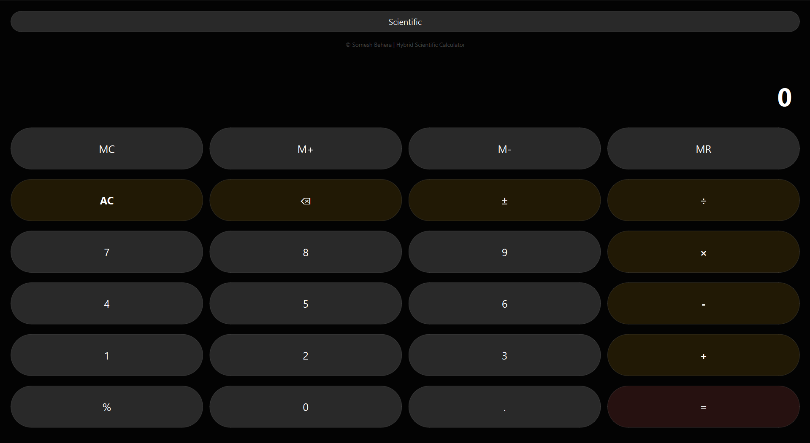
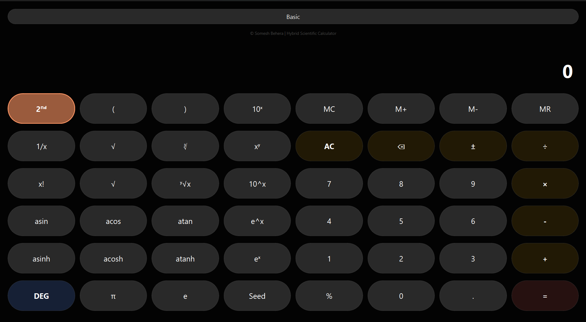

# 🧮 Hybrid Scientific Calculator

A versatile, high-precision **desktop calculator** that bridges everyday arithmetic and advanced scientific computation.
Built with **Python + PySide6**, this app features a **dual-mode interface** that adapts to your workflow while maintaining a persistent calculation state across modes.


## 🌟 Key Features

- ### Normal Mode:
    #### Optimized for quick 4-function arithmetic and memory operations.

- ### Scientific Mode
    #### Expanded button grid featuring:
    - Trigonometry (sin, cos, tan)
    - Logarithms (log, ln)
    - Powers & roots
    - Mathematical constants (π, e)

- ### 🧠 Advanced Math Engine
    - Custom expression evaluator based on the Shunting-Yard Algorithm
    - Correct operator precedence (BODMAS / PEMDAS)
    - No unsafe use of eval()

- ### 🎨 Modern Responsive UI
    - Dark theme with Glassmorphism-inspired design
    - Adaptive layout when switching modes
    - Smooth visual transitions

- ### 💾 Memory & Modes
    - Full memory support: MC, M+, M−, MR
    - Angle modes: DEG ↔ RAD for trigonometric functions
    - 2nd Function key for inverse operations (sin → asin, ln → eˣ, etc.)


## 🛠 Architecture

The project follows a **Controller–Engine–UI** modular pattern to maintain clean separation of concerns:

| Component     | Responsibility |
|--------------|----------------|
| engine.py     | Core logic: tokenization, infix → postfix conversion, expression evaluation |
| ui.py         | Builds UI layout, button grid, and dark theme styling |
| controller.py | Connects UI signals to the engine and manages app state |
| mapper.py     | Transforms text for complex functions like sqrt() |


## 📐 Mathematical Highlights: The Shunting-Yard Engine

Instead of relying on eval(), the calculator uses a real parsing pipeline:

1. **Tokenization**  
   Converts expressions like `sin(45)+pi` into structured tokens

2. **Postfix Conversion**  
   Applies **Dijkstra’s Shunting-Yard Algorithm** to resolve operator precedence

3. **Safe Evaluation**  
   Includes domain checks for:
   - Division by zero
   - Negative square roots
   - Invalid logarithmic inputs

This ensures both **accuracy and runtime safety**.
## 🚀 Getting Started

### ✅ Prerequisites

- **Python 3.8+**
- **PySide6**
## 🖼 Application Preview

### 🔢 Basic Mode

<p align="center">
  
</p>

### 🧪 Scientific Mode

<p align="center">
  
</p>

<p align="center">
  
</p>


## 📦 Installation

### 🅰 Option A: Run From Source Code

#### 1. Clone the Repository

```bash
    git clone https://github.com/Someshx98/scientific-calculator.git
    cd scientific-calculator
```

#### 2. Install Dependencies
```bash
    pip install PySide6
```
#### 3. Run the Application
```bash
    python main.py
```
### 🅱️ Option B: Install Using EXE (No Python Needed)

#### 1. Visit the Releases Section  
🔗 [**Download from here**](https://github.com/Someshx98/scientific-calculator/releases)

#### 2. Download the latest .exe setup file

#### 3. Run the installer and follow the setup steps

#### 4. Launch directly from Desktop or Start Menu

## 🖥 Usage

- ### 🔀 Switch Modes
    - Click the **Scientific / Basic** toggle to change layouts

- ### 🧪 Advanced Functions
    - In Scientific Mode, press **2ⁿᵈ** to access:
        - Inverse trigonometric functions
        - Exponential variants

- ### 🎲 Randomization Tools
    - `Rand` generates random numbers
    - `Seed` (via 2nd mode) fixes randomness using current result
## 🛣 Future Enhancements

- 📜 Calculation **history panel**
- 🧩 **Plugin system** for new math functions
- 🌈 **Theme switching** (light / neon / AMOLED)
- ⌨ **Keyboard** input support
- 📱 **Mobile UI** adaptation
- ✨ **UI polish, smooth animations, refinement** will even better


## Authors

- GitHub: [@Someshx98](https://www.github.com/Someshx98)
- Somesh Behera
- B.Tech Computer Science Student
- Build to Explore:
    - Stack-based expression evaluation
    - Desktop UI engineering with PySide6
    - Modular software architecture
- Engineering a Hybrid Scientific Calculator

